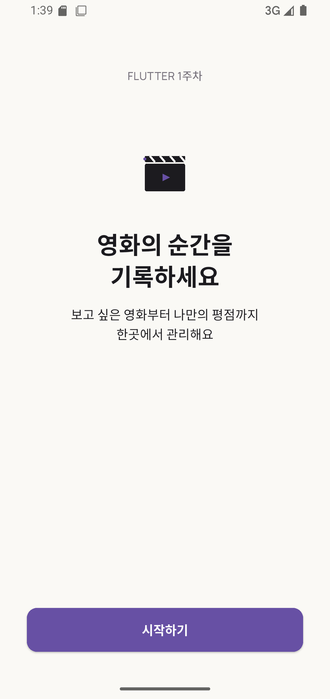
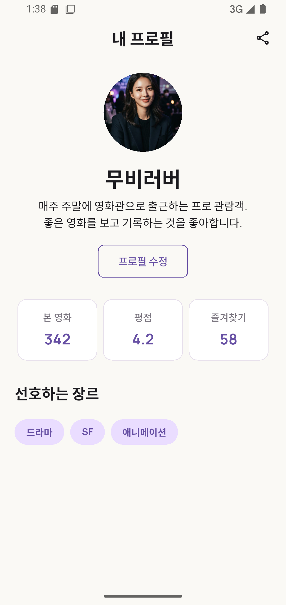

# MovieLog · Week 01

Flutter 기본 Widget과 Material 3 테마를 이용해 MovieLog 시작 화면과 정적 프로필 화면을 구현한 1주차 프로젝트입니다.

## 구현 내용

- Material 3 기반 `ThemeData`, `ColorScheme`, 공통 AppBar 적용
- Manrope Font와 로컬 이미지·SVG Asset 등록
- MovieLog SVG 로고를 사용한 시작 화면 구현
- 비트맵 프로필 이미지와 SVG 공유 아이콘 표시
- 재사용 가능한 `StatItem`으로 통계 카드 3개 구성
- 데이터 목록과 `map`을 이용해 통계와 선호 장르 UI 생성
- 화면을 의미 단위의 Widget으로 분리

## 실행 화면

### 시작 화면



### 프로필 화면



## 프로젝트 구조

```text
lib/
├─ main.dart
├─ movie_log_app.dart
├─ screens/
│  ├─ start_screen.dart
│  └─ profile_screen.dart
├─ theme/
│  ├─ app_colors.dart
│  ├─ app_text_styles.dart
│  └─ app_theme.dart
└─ widgets/
   ├─ common_app_bar.dart
   ├─ favorite_genres.dart
   ├─ profile_header.dart
   ├─ profile_stats.dart
   └─ stat_item.dart
```

## 실행 방법

기본 실행 화면은 프로필 화면입니다.

```powershell
flutter pub get
flutter analyze
flutter test
flutter run
```

시작 화면은 화면 이동을 연결하지 않고 다음 명령으로 별도 확인합니다.

```powershell
flutter run --dart-define=SHOW_START_SCREEN=true
```

## 학습 회고

공통 색상과 문자 스타일을 Theme 파일로 분리하면서 같은 디자인 값을 화면마다 반복하지 않는 방법을 익혔습니다. `Row`, `Column`, `Padding`, `Container`를 조합해 화면 구조를 만들고, 통계와 장르 데이터를 `map`으로 Widget으로 변환하면서 재사용 가능한 UI의 장점을 확인했습니다. 로컬 이미지와 SVG의 등록 방식이 다르고, 하위 Asset 폴더는 `pubspec.yaml`에 정확히 지정해야 한다는 점도 배웠습니다.
