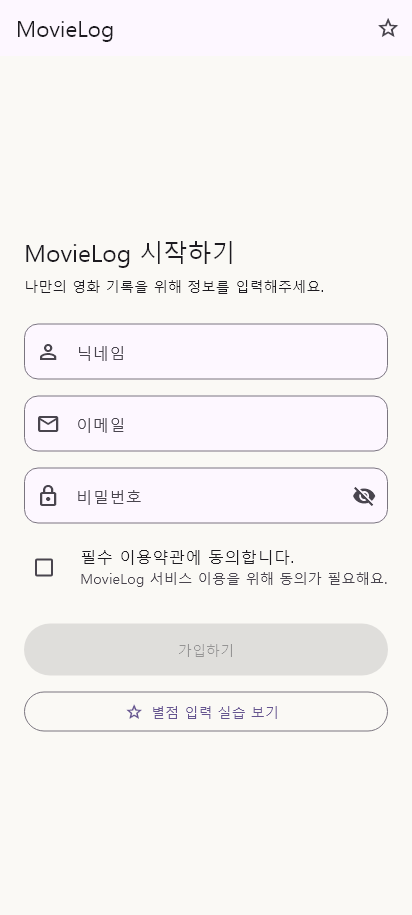
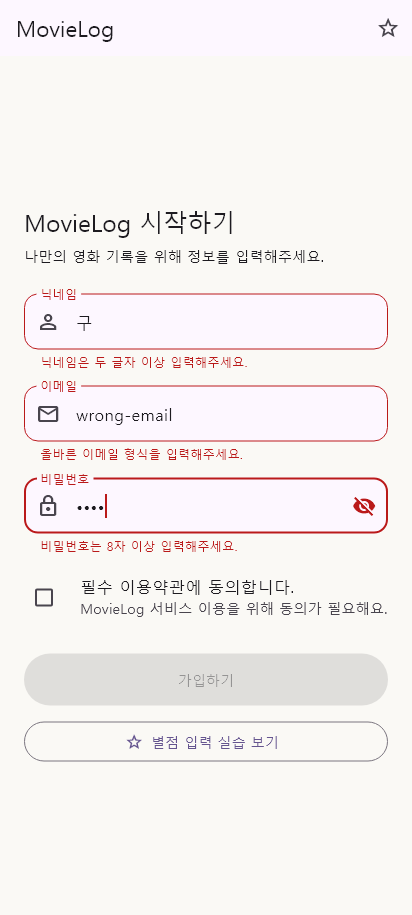
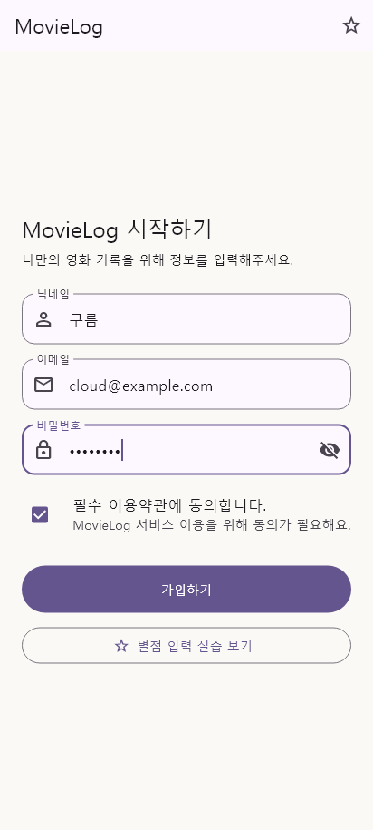
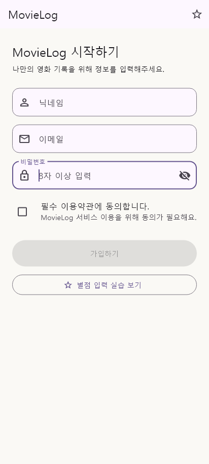
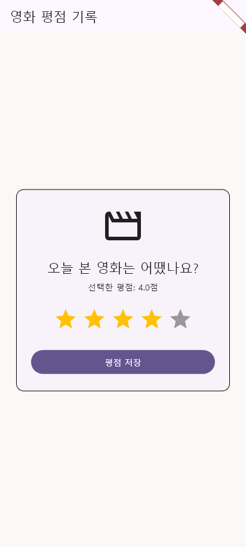
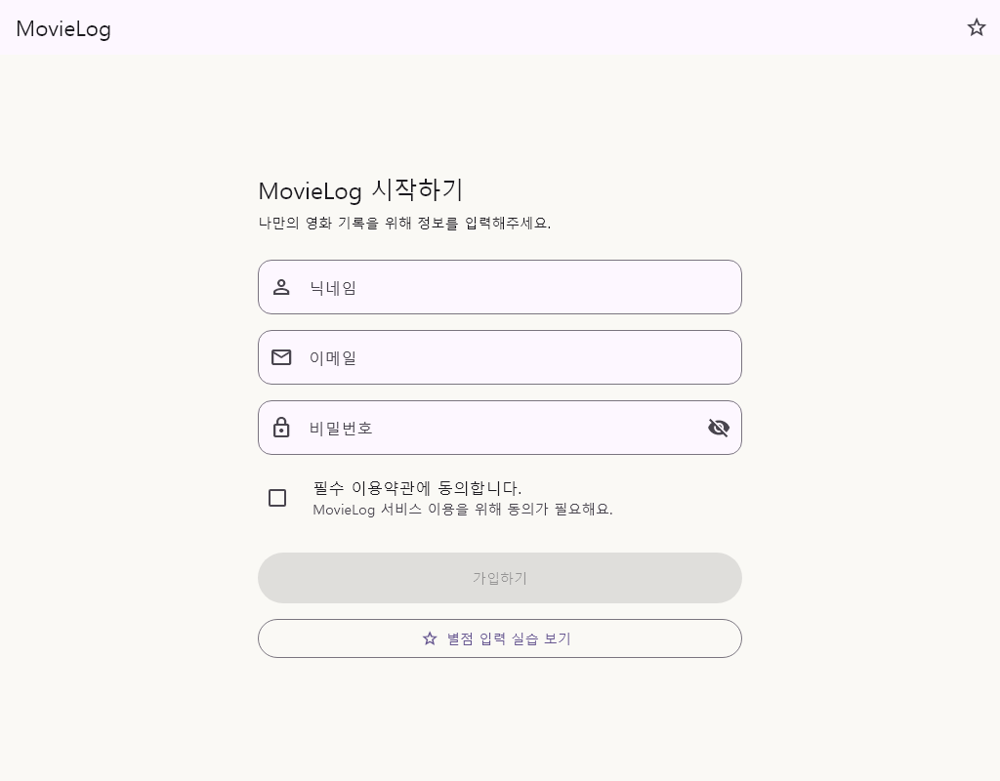

# MovieLog · Week 02

Flutter `Form`, `TextFormField`와 로컬 상태를 이용해 반응형 회원가입 Form과 영화 평점 입력 화면을 구현한 2주차 프로젝트입니다.

## 구현 내용

- 닉네임·이메일·비밀번호 입력과 한국어 Validator
- 필수 약관 동의 상태를 포함한 가입 버튼 활성화
- 가입 시 `FormState.validate()`를 통한 전체 재검증
- `TextEditingController`와 `FocusNode`의 생성·Focus 이동·dispose
- 비밀번호 표시·숨김과 공통 `MovieLogTextFormField`
- `SingleChildScrollView`를 이용한 키보드 Overflow 방지
- `LayoutBuilder` 기준 너비 700 이상에서 Form 최대 너비 560 적용
- `flutter_rating_bar`를 사용한 0.5점 단위 별점 입력과 저장 버튼 상태

## 실행 화면

### 입력 전



### Validation 오류



### 입력 완료



### 키보드가 열린 상태



### 평점 선택



### 넓은 화면 Challenge



## Validator 규칙

- 닉네임: 공백 제외 두 글자 이상
- 이메일: `@` 앞뒤 문자와 도메인 형식 확인
- 비밀번호: 8자 이상
- 약관: 필수 동의

## 프로젝트 구조

```text
lib/
├─ main.dart
├─ movie_log_app.dart
├─ screens/
│  ├─ sign_up_screen.dart
│  └─ rating_practice_screen.dart
├─ validators/
│  └─ input_validators.dart
├─ widgets/
│  ├─ movie_log_text_form_field.dart
│  ├─ terms_agreement.dart
│  └─ rating_input.dart
└─ theme/
```

## 실행 방법

```powershell
flutter pub get
flutter analyze
flutter test
flutter run
```

회원가입 화면 오른쪽 위 별 아이콘이나 `별점 입력 실습 보기` 버튼으로 평점 화면을 열 수 있습니다.

## 학습 회고

`Form`은 여러 `TextFormField`의 검증 결과를 한 번에 관리하고, 각 Validator는 오류 문구 또는 `null`을 반환한다는 규칙을 익혔습니다. Controller와 FocusNode를 `build` 밖의 State에서 만들고 `dispose`해야 입력과 Focus가 rebuild 과정에서 유지된다는 점도 확인했습니다. 버튼의 빠른 활성화 조건과 제출 시 전체 Validator 검증을 분리했으며, `SingleChildScrollView`와 `LayoutBuilder`를 조합해 키보드와 넓은 화면에서도 같은 상태 로직을 재사용했습니다.

## 트러블슈팅

- 문제: 키보드가 열릴 때 작은 화면에서 Form 하단에 접근하기 어려움
- 원인: 입력 Form의 전체 높이가 사용 가능한 화면 높이보다 커질 수 있음
- 수정: Form 전체를 `SingleChildScrollView`로 감싸고 `keyboardDismissBehavior.onDrag` 적용
- 모바일 결과: 입력창과 버튼까지 스크롤 가능하며 Overflow 없음
- 넓은 화면 결과: 700 Logical Pixel 이상에서 중앙 정렬되고 최대 너비 560 유지
