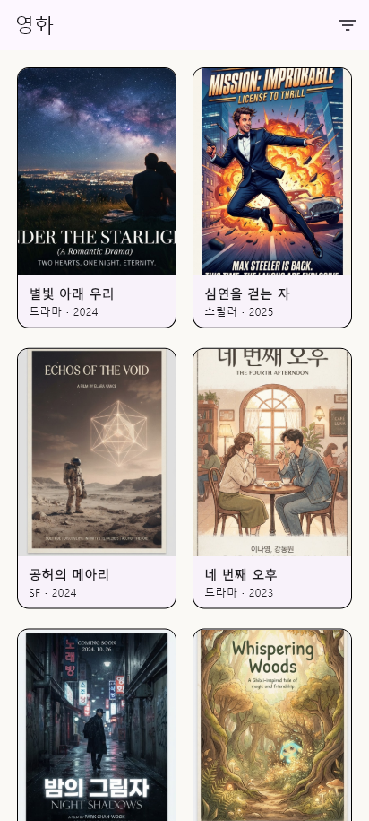
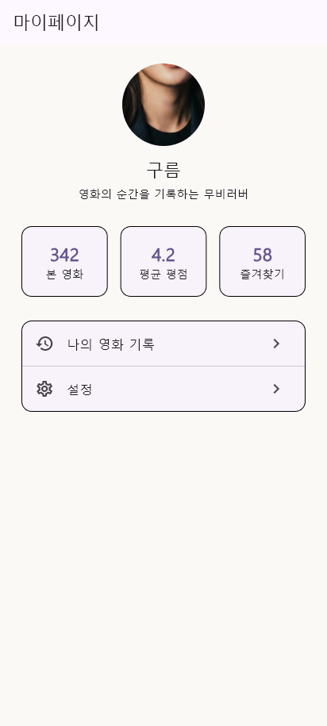
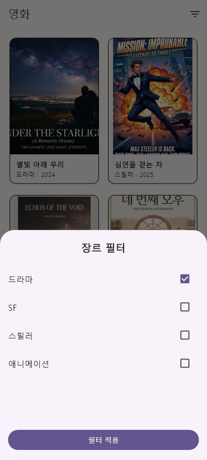
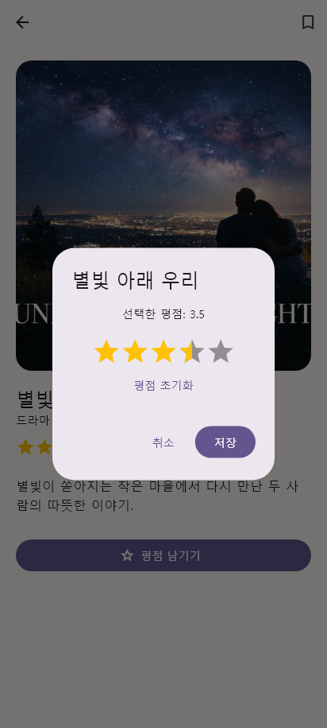
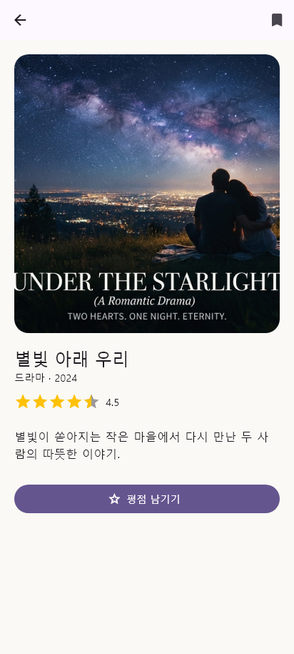

# MovieLog · Week 03

GoRouter와 Material 3로 시작·회원가입·홈·영화 목록·상세·마이페이지를 연결하고 사용자 인터랙션을 구현한 3주차 프로젝트입니다.

## 구현 내용

- `MaterialApp.router`와 `go_router 18.0.1`
- 시작 → 회원가입 → 홈의 교체형 이동 흐름
- `StatefulShellRoute.indexedStack`으로 탭별 상태를 보존하는 NavigationBar
- 동일한 Mock Movie 데이터 기반 홈·목록·상세 화면
- Path Parameter `/movies/:movieId`로 상세 진입 및 `pop()` 복귀
- Query Parameter `genres`로 선택 장르 표현
- 다중 장르 선택 `DraggableScrollableSheet`
- 평균 평점 `RatingBarIndicator`와 입력용 별점 Dialog
- 즐겨찾기 상태 변경 및 Snackbar 안내

## 실행 화면

| 홈 | 영화 목록 |
|---|---|
|  |  |

| 영화 상세 | 마이페이지 |
|---|---|
|  |  |

### 장르 필터 BottomSheet



### 평점 Dialog



### 즐겨찾기 Snackbar



## Route 목록

```text
/start
/register
/home
/movies?genres=드라마,SF
/movies/:movieId
/my
```

## 화면 전환 기준

- `go`: 시작 → 회원가입, 회원가입 → 홈, NavigationBar 탭, 필터 Query 반영
- `push`: 홈·목록의 영화 카드 → 상세
- `pop`: 상세 → 이전 화면, Dialog 및 BottomSheet 닫기
- `Path Parameter`: 상세 화면의 `movieId`
- `Query Parameter`: 영화 목록의 복수 장르 필터
- `Extra`: 새로고침과 Deep Link에 취약할 수 있어 필수 데이터 전달에는 사용하지 않음

## 실행 방법

```powershell
flutter pub get
flutter analyze
flutter test
flutter run
```

## 트러블슈팅

- 출발 Route: `/movies`
- 목적 Route: `/movies/1`
- 사용 방식: `push` 후 `pop`
- 전달 값: Path Parameter의 영화 ID
- 예상 Back Stack: 영화 목록 위에 상세 화면이 쌓이고 뒤로 가면 목록 상태 복원
- 수정: 상세 Route를 Shell 밖의 root Navigator에 두고 카드 Tap에는 `push` 사용
- 확인: 상세에서 뒤로 가기 후 영화 목록과 선택된 탭 유지

## 3주차 회고

`go`는 현재 Route 구성을 바꾸고 `push`는 기존 화면 위에 상세 화면을 쌓는다는 차이를 실제 Back Stack으로 확인했습니다. URL에서 복구할 수 있어야 하는 영화 ID와 필터는 Path·Query Parameter로 전달하고, 화면 객체만 전달하는 `extra`에는 의존하지 않았습니다. `StatefulShellRoute.indexedStack`으로 탭마다 Navigator 상태를 유지하면서 공통 NavigationBar를 한 번만 선언하는 구조도 익혔습니다. Dialog, BottomSheet, Snackbar가 각각 결정 입력, 보조 작업, 짧은 결과 안내에 적합하다는 점을 구현을 통해 구분했습니다.
